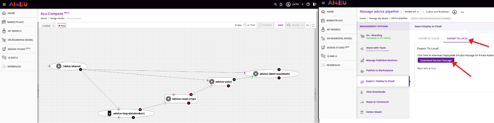

# ADVICE AI4EU Solution Experiment

ADVICE: AI-baseD predictiVe road maIntenanCE

## Deployment Cheatsheet

Once the pipeline has been built on the AI4EU platform and exported to local:

0. Install docker and kubectl

1. Install minikube and start it:

          minikube start

2. Deactivate de Firewall to mount host's folder on the minikube virtual machine:

          ip r g $(minikube ip)|awk '{print $3}'|head -n1|xargs sudo ufw allow in on
          sudo ufw reload

3. Mount folder:
     
          minikube mount -v 5 <path-to>/advice-platform-pipeline/shared_folder:/tmp/hostpath-provisioner/test/pipeline

4. In other terminal, create namespace:
     
          kubectl create namespace test

5. Unzip solution.zip file

6. Run script (note IP address and port of the orchestrator):

          cd <path-to-unzipped-solution-folder>
          python3 kubernetes-client-script.py -n test

7. Wait until images are successfully pulled. For that purpose, run the following command:

          kubectl -n test get pod,svc -o wide

8.  Run orchestrator script to start the pipeline, using the IP and port noted before:

          python3 orchestrator_client/orchestrator_client.py -e 192.168.49.2:30004 -b .

## Acknowledgement

***

Supported by AI4EU - A European AI On Demand Platform and Ecosystem.  
More information: <a href="https://www.ai4europe.eu/">ai4europe.eu</a>

  

This project has received funding from the European Union's Horizon 2020  
research and innovation programme under grant agreement 825619.

## Help

* Rafael Luque - rluque@catec.aero
* Adrian Rodriguez - arodriguez@catec.aero
* Other community or team contact